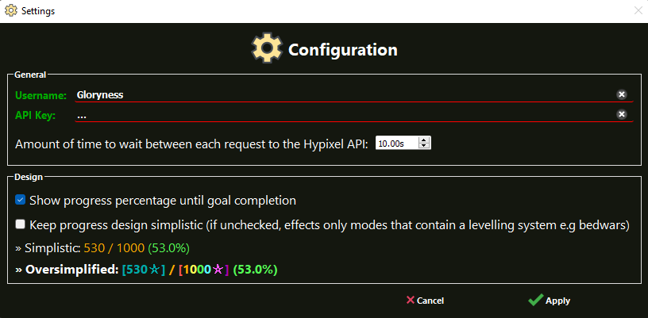

# Hypixel Goal Tracker
A desktop application to track anything on the Hypixel Network.

## 🖥️ Executable File Installation
- Windows only
- You can download the latest executable file [here](https://github.com/Gloryness/hypixel-goal-tracker/releases)

## 💻 Developing

### ⚒️ Requirements
-   [`Python`]: For running code (`v3.8.2`)
-   [`Pip`]: Installing packages and running scripts
    -   `pyqt5-tools`: The overall Graphical User Interface.
    -   `requests`: Non asyncronous requests
    -   `packaging`: Dealing with versions
-   [`Hypixel API Key`]: For fetching stats from Hypixel. Run `/api new` on hypixel.net

## 📙 Features
- Dark theme based UI.
- Able to track almost every statistic for any gamemode.
- Keep track of how many goals you have completed.
- Configuration

## 🏹 Preview

<!-- LINKS -->
[`python`]: https://www.python.org/
[`pip`]: https://pip.pypa.io/en/stable/installation/
[`hypixel api key`]: https://api.hypixel.net/
